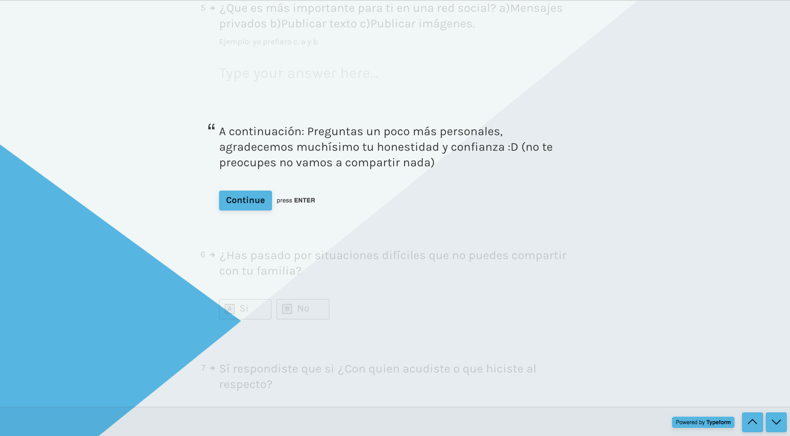
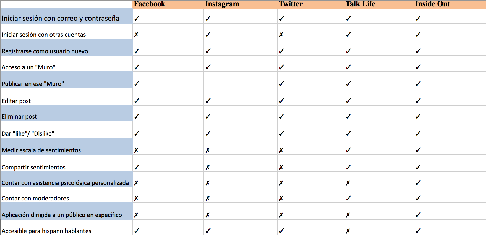

# **Introducción**

Gracias a la tecnología, hoy en día contamos con diversas herramientas útiles para la educación que nos facilitan nuestro día a día. Sin embargo, cuando se trata de nuestra salud mental y emocional, no contamos con la misma suerte. Lamentablemente, hablar sobre salud mental y emocional sigue siendo hasta nuestros días un tema complicado de hablar debido a los tantos prejuicios que aún existen en torno a él y sobre todo, entre los jóvenes en desarrollo.

## **Análisis argumentativo de la elección de la red social**

Uno de los temas de mayor complejidad social es el relativo al suicidio, el cual se deriva cuando una persona en situación emocional vulnerable, no encuentra otra salida.

Se trata de un fenómeno determinado por las precarias condiciones de salud mental de amplios sectores de la población, y el cual se asocia a múltiples factores, que van desde el padecimiento de enfermedades crónico-degenerativas, hasta problemáticas vinculadas con desórdenes de la personalidad.

La tendencia registrada de la mortalidad por suicidios en el país va en aumento, y se ha llegado a niveles más que preocupantes; en efecto, los datos de los años 2015 y 2016, registrados por el Instituto Nacional de Estadística y Geografía (INEGI), muestran indicadores de 6,425 y 6,370 casos, respectivamente.

De manera acumulada, entre los años 2010 y 2016, el INEGI estima que se han consumado 41,321 casos de suicidio en todo el país; sin embargo, en estudios previos, dados a conocer mediante la publicación Estadísticas de Suicidio e Intentos de Suicidio (la cual lamentablemente dejó de editar hace algunos años), el propio INEGI alertaba que, por cada caso en que se concretaba el suicidio, podría haber hasta 8 casos en los que la persona que lo intentó había fallado en su propósito.

En números absolutos, las entidades en donde se han registrado más casos de suicidios entre los años 2010 y 2016 son las siguientes: 1) el Estado de México, con 4,271 casos; 2) Jalisco, con 3,471 casos; 3) Ciudad de México, con 2,819 casos; 4) Guanajuato, con 2,677 casos; 5) Chihuahua, con 2,284 casos; 6) Veracruz, con 1,903 casos; 7) Chiapas, con 1,731 casos; 8) Nuevo León, con 1,695 casos; 9) Puebla, con 1,688 casos; 10) Sonora, con 1,472 casos; 11) Yucatán, con 1,314 casos; 12) Tabasco, con 1,204 casos; 13) Coahuila, con 1,188 casos; 14) San Luis Potosí con 1,154 casos; 15) Michoacán con 1,133 casos y 16) Tamaulipas, con 1,124 casos.

Podemos construir otro análisis a través de las tasas de suicidio en cada una de las entidades; las cuales indican  que el 95% de los suicidios se registran entre la población de 15 años en adelante, es decir, el comienzo de la adolescencia es la etapa más vulnerable.

Hablamos con la  psicóloga Paulina Treviño sobre el tema, y nos comentó que el exteriorizar  de forma verbal o escrita la conducta suicida, reducía la posibilidad de concretarlo.

Es por ello que decidimos crear InsideOut, una red social especializada en la salud mental y emocional para jóvenes. 

## **Encuesta**

Realizamos una encuesta a 20 jóvenes para saber qué es lo que quisieran poder hacer en nuestra red social:

## **Sketching**

## **Target, argumentación del proyecto**

InsideOut permite a los usuarios de entre los 15 y 19 años de edad, compartir con otros jóvenes aquellos temas o situaciones en las que no se sienten cómodos compartiendo con su familia; permitiéndoles así, ser parte de una red de apoyo. 

El usuario, cuenta con un perfil en donde puede poner un rango del cómo se siente en ese momento y compartirlo al igual que sus comentarios. En caso de que el usuario necesite atención inmediata, cuenta con un acceso a una línea telefónica de ayuda psicológica.

Además, la aplicación contará con moderadores para evitar el mal uso de la aplicación y con psicólogos que estarán al tanto de los usuarios, tomando el papel de amigo, y así los jóvenes no sentirán que están en terapia. 

## **Historia de usuario**

Yo como usuarix quiero poder poseer una cuenta.

Yo como usuarix quiero que también pueda accesar con alguna de mis cuentas ya existentes.

Yo como usuarix quiero poder compartir mis inquietudes con amigos que hayan pasado o estén pasando por algo similar a mi situación y que así nos podamos apoyar mutuamente.

Yo como usuarix quiero contar con un perfil donde pueda personalizar mi interacción con la aplicación.

Yo como usuarix quiero contar con apoyo en todo momento.

Yo como usuarix quiero que mis comentarios sean respetados.

## **Inversión** 

Para la inversionista, InsideOut es un modelo de negocio a largo a plazo. Una vez en el mercado, con un número determinado de usuarios y una data generada, ésta se ofrecerá a instituciones involucradas en el tratamiento de la salud mental, para que así, puedan obtener información más integral sobre este padecimiento y proponer soluciones para disminuirlo.

## **Benchmark**

